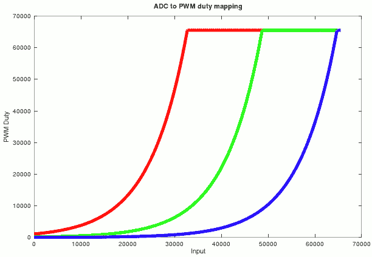

## PWM driven colored LEDs

Example code [demo-pwm-colors](../app/demo-pwm-colors/src/main.rs)


This example uses connected display and potentiometer from the [previous one](adc-multicore.md)
and adds 3 PWM channels to drive RGB LED. LED color and brightness changes according to the
value read from ADC, that corresponds to the potentiometer position.

## Setting up PWM channels

There are 8 PWM slices on RPi Pico where each slice can have different frequency, and each slice
has two channels A and B where each can have different duty, that gives us up to 16 channels.

Each PWM slice and channel can be set to work only with some output GPIO pins, available combinations
are in the following table:

Valid PWM slice and channel A, B pins for Rpi Pico:

| Slice | Ch. A  | Ch. B |
| ----- | ------ | ----- |
| 0     | 0, 16  | 1,17  |
| 1     | 2, 18  | 3,19  |
| 2     | 4, 20  | 5,21  |
| 3     | 6, 22  | 7,23  |
| 4     | 8, 24  | 9,25  |
| 5     | 10, 26 | 11,27 |
| 6     | 12, 28 | 13,29 |
| 7     | 14, 5  |       |

This example uses GPIO 13, 14, 15 for PWM output, so the code is

```rust
    let mut pwm_slices = hal::pwm::Slices::new(pac.PWM, &mut pac.RESETS);

    let pwm6 = &mut pwm_slices.pwm6;
    pwm6.set_ph_correct();
    pwm6.enable();

    let pwm7 = &mut pwm_slices.pwm7;
    pwm7.set_ph_correct();
    pwm7.enable();

    let channel_r = &mut pwm6.channel_b;
    let channel_g = &mut pwm7.channel_a;
    let channel_b = &mut pwm7.channel_b;

    channel_r.output_to(pins.gpio13);
    channel_g.output_to(pins.gpio14);
    channel_b.output_to(pins.gpio15);

    // ...
    // channel_r.set_duty(100);
    // channel_g.set_duty(1000);
    // channel_b.set_duty(10000);
```

## Computing duties

Duty values for 16-bit channels can range from 0 (off) to 65535 (always on).
In order to provide feeling of linear light luminosity change, duty value has to be exponential
in respect to input ADC value. More that that, I wanted also light temperature to change
in respect to the input value, starting with red, going to yellow and ending as cold white at
the end. To model duty values, I created an [octave script](pwm-colors/mapping.m) to see the values



Code computes duty according to this script

```rust
let input = // .. input value normalized to 0..65535 range
let max_log_val = (MAX_VALUE as f32).ln(); // MAX value is 65535

// red is always a little bit ON, min duty is 1500/65535
let r = max(1500, minf(input/8000.0 + 7.0, max_log_val).exp() as u16);
let g = minf(input/8000.0 + 5.0, max_log_val).exp() as u16;
let b = minf(input/8000.0 + 3.0, max_log_val).exp() as u16;

channel_r.set_duty(r);
channel_g.set_duty(g);
channel_b.set_duty(b);
```

## RGB LED strip control

Adding a 12V to 3.3V voltage converted and a MOSFET switch, it os possible to drive
 a RGB LED strip

